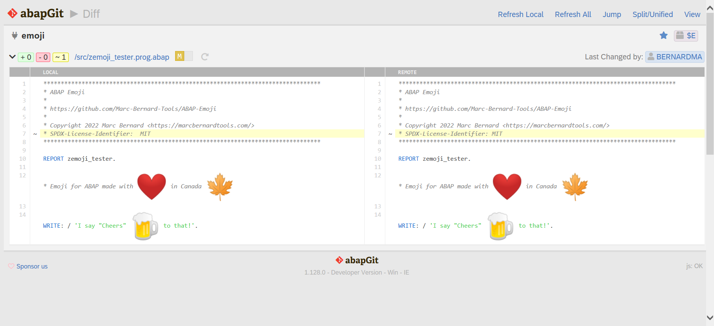

[](LICENSE)
[](https://github.com/abapPM/.github/blob/main/CODE_OF_CONDUCT.md)
[](https://api.reuse.software/info/github.com/abapPM/ABAP-Emoji)

# ✨ ABAP-Emoji ✨

Emoji for ABAP

Made by [Marc Bernard](https://marcbernardtools.com/) giving back to the [SAP Community](https://community.sap.com/)

Based on [Twitter Emoji](https://github.com/twitter/twemoji) and [Twemoji Amazing](https://github.com/SebastianAigner/twemoji-amazing) (MIT License)

NO WARRANTIES, [MIT License](LICENSE)

## Prerequisite

HTML output with Internet connection since Emoji graphics are hosted on https://twemoji.maxcdn.com/.

## Installation

You can install ABAP Emoji using [abapGit](https://github.com/abapGit/abapGit) either creating a new online repository for https://github.com/Marc-Bernard-Tools/ABAP_Emoji or downloading the repository [ZIP file](https://github.com/abapPM/ABAP_Emoji/archive/main.zip) and creating a new offline repository.

We recommend to use package `$EMOJI`.

## Usage

### Emoji

Use [Twemoji Cheatsheet](https://twemoji-cheatsheet.vercel.app/) to view all supported Emoji. 

To find the name of an Emoji, go to the official [Unicode Emoji List](https://unicode.org/emoji/charts/emoji-list.html). The name is based on the "CLDR short name" with spaces replaced by `-`.

Other helpful sources: [Emoji Test (Plain Text List)](https://unicode.org/Public/emoji/13.1/emoji-test.txt), [Emoji JSON](https://github.com/amio/emoji.json), 
[Emoji Community Projects](https://github.com/twitter/twemoji#community-projects).

### ABAP

```abap
write zcl_emoji=>create( )->format_emoji( 'I :red-heart: ABAP' ).
```

### Output

I ❤️ ABAP

```html
I <i class="twa twa-red-heart"></i> ABAP
```

Note: Include [`twemoji-amazing.css`](https://github.com/abapPM/ABAP-Emoji/blob/main/css/twemoji-amazing.css) in your HTML output.

## Integrate with abapGit (Developer Version)



1. Insert one line into the following class

```abap
CLASS zcl_abapgit_syntax_highlighter IMPLEMENTATION.
...
  METHOD apply_style.
...
    lv_escaped = show_hidden_chars( lv_escaped ).

    lv_escaped = zcl_emoji=>create( )->format_emoji( lv_escaped ). "<<< insert
...
  ENDMETHOD.
```

2. Start transaction `SMW0` > `Binary data` > `$ABAPGIT` 
3. Edit `ZABAPGIT_ICON_FONT_CSS`
4. Append [`twemoji-amazing.css`](https://github.com/mbtools/ABAP-Emoji/blob/main/css/twemoji-amazing.css) to the icon css and save

## Contributions

All contributions are welcome! Read our [Contribution Guidelines](CONTRIBUTING.md), fork this repo, and create a pull request.

You can install the developer version of ABAP Emoji using [abapGit](https://github.com/abapGit/abapGit) either by creating a new online repository for https://github.com/abapPM/ABAP-Emoji.

Recommended SAP package: `$EMOJI`.

## About

Made with :heart: in Canada

Copyright 2024 apm.to Inc. <https://apm.to>

Follow [@marcfbe](https://twitter.com/marcfbe) on X/Twitter
